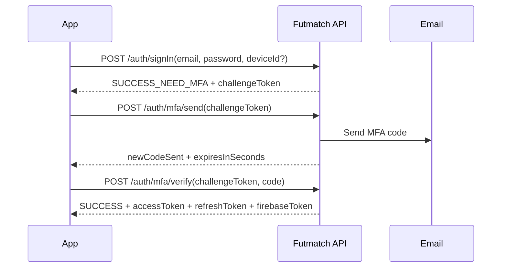

# Auth Endpoints Documentation

This document provides a detailed description of the authentication-related endpoints, including request validation rules, example requests and responses, and mobile migration notes for the MFA login challenge flow.

## Common Concepts

### AppResult

All endpoints return a standardized `AppResult` object.

*   **On Success:** It returns `{"status":"success","data":{...}}`.
*   **On Failure:** It returns `{"status":"error","error":{...}}`.

### Locales

To receive localized responses, include an `Accept-Language` header with one of the supported language tags (e.g., `en-US`, `es-MX`).

### Device Info

Most authentication and registration endpoints require device information for security purposes. This should be sent in the `User-Agent` header.

### Firebase Integration

Successful authentication responses now include a `firebaseToken`. This is a Custom Token that the client should use to authenticate with the Firebase SDK (`signInWithCustomToken`).

### Client Migration Note

The login MFA flow is migrating from a legacy payload based on `userId + deviceId` to a new payload based on `challengeToken`.

Current backend behavior:

- preferred flow: `challengeToken`
- temporary compatibility: `userId + deviceId` is still accepted in `POST /auth/mfa/send` and `POST /auth/mfa/verify`
- legacy support is deprecated and will be removed after client migration

---

## 1. Registration Flow

The registration process follows a 2-step verification flow.

### 1.1 Start Registration

Initiates the registration process and sends a verification code to the user's email.

*   **Method:** `POST`
*   **Path:** `/auth/register/start`
*   **Description:** Validates user data and creates a pending registration record.

#### Validation Rules

| Field | Type | Required | Validation Rules |
| :--- | :--- | :--- | :--- |
| `name` | String | Yes | Must not be blank. Max 30 chars. Valid name characters only. |
| `lastName` | String | Yes | Must not be blank. Max 30 chars. Valid name characters only. |
| `email` | String | Yes | Must match email format. |
| `phone` | String | Yes | Must match phone format. |
| `password` | String | Yes | Minimum 8 chars, uppercase, lowercase, digit, and special character. |
| `birthDate` | Long | Yes | Must represent an adult user. |
| `country` | String | Yes | Required. |
| `playerPosition` | Enum | Yes | Valid enum value. |
| `gender` | Enum | Yes | Valid enum value. |
| `level` | Enum | Yes | Valid enum value. |
| `userRole` | Enum | No | Valid enum value. Default `PLAYER`. |

#### Example Request:
```json
{
    "name": "John",
    "lastName": "Doe",
    "email": "john.doe@example.com",
    "password": "SecurePassword123!",
    "phone": "1234567890",
    "country": "US",
    "birthDate": 946684800000,
    "playerPosition": "MIDFIELDER",
    "gender": "MALE",
    "profilePic": null, // (Optional)
    "level": "AMATEUR",
    "userRole": "PLAYER" // (Optional) Default: PLAYER
}
```

#### Example Success Response:
```json
{
    "status": "success",
    "data": {
        "success": true,
        "message": "Verification code sent to your email.",
        "resendCodeTimeInSeconds": 60
    }
}
```

### 1.2 Complete Registration

Completes the registration using the verification code sent to the email.

*   **Method:** `POST`
*   **Path:** `/auth/register/complete`
*   **Description:** Verifies the code and creates the user and a trusted device record. **Requires `User-Agent` header.**

#### Validation Rules

| Field | Type | Required | Validation Rules |
| :--- | :--- | :--- | :--- |
| `email` | String | Yes | Must match email format. |
| `verificationCode` | String | Yes | Must not be blank. |

#### Example Request:
```json
{
    "email": "john.doe@example.com",
    "verificationCode": "123456"
}
```

#### Example Success Response:
Returns full authentication tokens upon successful verification, including the Firebase Custom Token.

```json
{
    "status": "success",
    "data": {
        "userId": "a1b2c3d4-e5f6-7890-1234-567890abcdef",
        "deviceId": "b2c3d4e5-f6a7-8901-2345-67890abcdef1",
        "authTokenResponse": {
            "accessToken": "ey...",
            "refreshToken": "ey..."
        },
        "firebaseToken": "ey_firebase_custom_token...",
        "authCode": "SUCCESS"
    }
}
```

### 1.3 Resend Registration Code

Resends the verification code if it has expired or was not received.

*   **Method:** `POST`
*   **Path:** `/auth/register/resend-code`

#### Validation Rules

| Field | Type | Required | Validation Rules |
| :--- | :--- | :--- | :--- |
| `email` | String | Yes | Must match email format. |

#### Example Request:
```json
{
    "email": "john.doe@example.com"
}
```

#### Example Success Response:
```json
{
    "status": "success",
    "data": {
        "success": true,
        "message": "Verification code resent successfully.",
        "resendCodeTimeInSeconds": 60
    }
}
```

---

## 2. Authentication Flow

### 2.1 Sign In

Authenticates a user and returns JWT tokens or an MFA challenge.

*   **Method:** `POST`
*   **Path:** `/auth/signIn`
*   **Description:** Authenticates a user with email and password. **Requires `User-Agent` header.**
*   **Lockout Policy:** Multiple failed attempts will temporarily lock the account.

#### Validation Rules

| Field | Type | Required | Validation Rules |
| :--- | :--- | :--- | :--- |
| `email` | String | Yes | Must match email format. |
| `password` | String | Yes | Must satisfy password complexity rules. |
| `deviceId` | UUID | No | Optional. If present, must be a valid non-empty UUID. |

#### Example Request:
```json
{
    "email": "john.doe@example.com",
    "password": "SecurePassword123!",
    "deviceId": "b2c3d4e5-f6a7-8901-2345-67890abcdef1" // (Optional)
}
```
*   `deviceId`: Optional. If provided and trusted, MFA might be skipped.

#### Example Success Responses:

**A) Full Authentication:**
```json
{
    "status": "success",
    "data": {
        "userId": "a1b2c3d4-e5f6-7890-1234-567890abcdef",
        "deviceId": "b2c3d4e5-f6a7-8901-2345-67890abcdef1",
        "authTokenResponse": {
            "accessToken": "ey...",
            "refreshToken": "ey..."
        },
        "firebaseToken": "ey_firebase_custom_token...",
        "authCode": "SUCCESS"
    }
}
```

**B) MFA Required:**
Returned if the device is unknown, not trusted, or the user's email is not yet verified.
```json
{
    "status": "success",
    "data": {
        "userId": "a1b2c3d4-e5f6-7890-1234-567890abcdef",
        "deviceId": "c3d4e5f6-a7b8-9012-3456-7890abcdef12",
        "challengeToken": "eyJhbGciOiJub25lIn0.login-mfa-challenge",
        "authCode": "SUCCESS_NEED_MFA"
    }
}
```

Mobile migration summary:

- temporary response during migration: `challengeToken` plus `userId` and `deviceId`
- old client flow: use `userId` and `deviceId` and forward them to `mfa/send` and `mfa/verify`
- new client flow: use only `challengeToken`
- recommended client state: `pendingMfaChallengeToken`

### 2.2 Send MFA Code

Sends an MFA code to the user for Sign In verification.

*   **Method:** `POST`
*   **Path:** `/auth/mfa/send`
*   **Preferred contract:** `challengeToken`
*   **Deprecated contract:** `userId + deviceId` is still accepted temporarily for backward compatibility and will be removed after client migration.

#### Validation Rules

Preferred request:

| Field | Type | Required | Validation Rules |
| :--- | :--- | :--- | :--- |
| `challengeToken` | String | Yes | Must not be blank. |

Temporary legacy request still accepted:

| Field | Type | Required | Validation Rules |
| :--- | :--- | :--- | :--- |
| `userId` | UUID | Yes | Valid non-empty UUID. |
| `deviceId` | UUID | Yes | Valid non-empty UUID. |

#### Example Request:
```json
{
    "challengeToken": "eyJhbGciOiJub25lIn0.login-mfa-challenge"
}
```

#### Legacy Request Example (Deprecated)
```json
{
    "userId": "a1b2c3d4-e5f6-7890-1234-567890abcdef",
    "deviceId": "c3d4e5f6-a7b8-9012-3456-7890abcdef12"
}
```

#### Example Success Response:
```json
{
    "status": "success",
    "data": {
        "newCodeSent": true,
        "expiresInSeconds": 300,
        "resendCodeTimeInSeconds": 60
    }
}
```

### 2.3 Verify MFA Code

Verifies the MFA code and completes the Sign In.

*   **Method:** `POST`
*   **Path:** `/auth/mfa/verify`
*   **Preferred contract:** `challengeToken + code`
*   **Deprecated contract:** `userId + deviceId + code` is still accepted temporarily for backward compatibility and will be removed after client migration.

#### Validation Rules

Preferred request:

| Field | Type | Required | Validation Rules |
| :--- | :--- | :--- | :--- |
| `challengeToken` | String | Yes | Must not be blank. |
| `code` | String | Yes | Must not be blank. |

Temporary legacy request still accepted:

| Field | Type | Required | Validation Rules |
| :--- | :--- | :--- | :--- |
| `userId` | UUID | Yes | Valid non-empty UUID. |
| `deviceId` | UUID | Yes | Valid non-empty UUID. |
| `code` | String | Yes | Must not be blank. |

#### Example Request:
```json
{
    "challengeToken": "eyJhbGciOiJub25lIn0.login-mfa-challenge",
    "code": "123456"
}
```

#### Legacy Request Example (Deprecated)
```json
{
    "userId": "a1b2c3d4-e5f6-7890-1234-567890abcdef",
    "deviceId": "c3d4e5f6-a7b8-9012-3456-7890abcdef12",
    "code": "123456"
}
```

#### Example Success Response:
```json
{
    "status": "success",
    "data": {
        "userId": "a1b2c3d4-e5f6-7890-1234-567890abcdef",
        "deviceId": "c3d4e5f6-a7b8-9012-3456-7890abcdef12",
        "authTokenResponse": {
            "accessToken": "ey...",
            "refreshToken": "ey..."
        },
        "firebaseToken": "ey_firebase_custom_token...",
        "authCode": "SUCCESS"
    }
}
```

---

## 3. Session Management

### 3.0 Access JWT Claims

Newly issued access JWTs now include:

- `user_identifier`
- `user_role`
- `device_identifier`

During the migration window, older access JWTs without `device_identifier` are still accepted. Endpoints already migrated to JWT device resolution will fall back to deprecated request-body `deviceId` support for those older tokens and will log a deprecation warning.

### 3.1 Refresh Token

Obtains a new access token using a refresh token.

*   **Method:** `POST`
*   **Path:** `/auth/refresh`
*   **Headers:** Requires `X-Refresh-Token: <refresh_token>`
*   **Description:** Provides a new `accessToken`. If the refresh token is near expiration, it will be rotated (a new `refreshToken` will be returned). **Note:** This endpoint does NOT return a new `firebaseToken`, as the Firebase SDK handles its own session refresh.
*   **Preferred source of truth:** the backend now resolves `userId + deviceId` from the `X-Refresh-Token` itself.
*   **Final contract for this phase:** the request body no longer carries `userId` or `deviceId`. Session ownership is derived only from the refresh token.

#### Validation Rules

| Field | Type | Required | Validation Rules |
| :--- | :--- | :--- | :--- |
| Request body | JSON object | Yes | Send `{}`. No body identifiers are required or used. |

#### Preferred Request Body:
```json
{}
```

#### Example Success Response (Rotation):
```json
{
    "status": "success",
    "data": {
        "userId": null,
        "deviceId": null,
        "authTokenResponse": {
            "accessToken": "ey_new_access...",
            "refreshToken": "ey_new_refresh..."
        },
        "firebaseToken": null,
        "authCode": "REFRESHED_BOTH_TOKENS"
    }
}
```

#### Current Status

- the backend now derives session ownership from the refresh token hash stored in DB
- clients should send `X-Refresh-Token` plus an empty JSON body
- refresh token reuse detection is now enabled for revoked or stale tokens on the same device

#### Client Migration Notes

1. Keep sending the `X-Refresh-Token` header exactly as before.
2. Stop sending `userId` and `deviceId` in the refresh request body.
3. Send `{}` as the refresh body.
4. Expect the same success response contract:
   - `REFRESHED_JWT`
   - `REFRESHED_BOTH_TOKENS`
5. If the backend returns refresh-token-invalid, clear the session and force full login.

### 3.2 Sign Out

Invalidates the session for a specific device.

*   **Method:** `POST`
*   **Path:** `/auth/signOut`
*   **Headers:** Requires `Authorization: Bearer <access_token>`
*   **Preferred source of truth:** `deviceId` is now read from the access JWT claim `device_identifier`.
*   **Temporary compatibility:** if an older access JWT does not contain `device_identifier`, the backend still accepts `deviceId` in the request body and logs a deprecation warning.
*   **Note:** The resolved `deviceId` must belong to the authenticated user.

#### Validation Rules

| Field | Type | Required | Validation Rules |
| :--- | :--- | :--- | :--- |
| `deviceId` | UUID | No | Deprecated fallback for older access JWTs without `device_identifier`. If present, it must be a valid non-empty UUID. |

#### Example Request:
```json
{
    "deviceId": "b2c3d4e5-f6a7-8901-2345-67890abcdef1"
}
```

#### Preferred Request After JWT Migration:
```json
{}
```

#### Example Success Response:
```json
{
    "status": "success",
    "data": {
        "success": true,
        "message": "Successfully signed out."
    }
}
```

---

## 4. Password Recovery

### 4.1 Forgot Password

Initiates the password reset process.

*   **Method:** `POST`
*   **Path:** `/auth/forgot-password`

#### Validation Rules

| Field | Type | Required | Validation Rules |
| :--- | :--- | :--- | :--- |
| `email` | String | Yes | Must match email format. |
*   **Security Note:** This endpoint always returns a generic success response to avoid account enumeration.

#### Example Request:
```json
{
    "email": "john.doe@example.com"
}
```

#### Example Success Response:
```json
{
    "status": "success",
    "data": {
        "newCodeSent": true,
        "expiresInSeconds": 300,
        "resendCodeTimeInSeconds": 60
    }
}
```

### 4.2 Verify Reset MFA

Verifies the password reset code and returns a temporary `resetToken`.

*   **Method:** `POST`
*   **Path:** `/auth/verify-reset-mfa`

#### Validation Rules

| Field | Type | Required | Validation Rules |
| :--- | :--- | :--- | :--- |
| `email` | String | Yes | Must match email format. |
| `code` | String | Yes | Must not be blank. |

#### Example Request:
```json
{
    "email": "john.doe@example.com",
    "code": "123456"
}
```

#### Example Success Response:
```json
{
    "status": "success",
    "data": {
        "resetToken": "a_single_use_reset_token"
    }
}
```

### 4.3 Update Password

Updates the password using the `resetToken`.

*   **Method:** `PUT`
*   **Path:** `/auth/password`
*   **Headers:** Requires `Authorization: Bearer <resetToken>`

#### Validation Rules

| Field | Type | Required | Validation Rules |
| :--- | :--- | :--- | :--- |
| `newPassword` | String | Yes | Must satisfy password complexity rules. |

---

## 5. Mobile Migration Guide

This section is intended for clients that still use the old MFA login flow.

### Login MFA Migration

Old flow:

1. `POST /auth/signIn`
2. receive `SUCCESS_NEED_MFA` with `userId` and `deviceId`
3. call `POST /auth/mfa/send` with `userId` and `deviceId`
4. call `POST /auth/mfa/verify` with `userId`, `deviceId`, and `code`

New flow:

1. `POST /auth/signIn`
2. receive `SUCCESS_NEED_MFA` with `challengeToken`
3. call `POST /auth/mfa/send` with `challengeToken`
4. call `POST /auth/mfa/verify` with `challengeToken` and `code`

### Client State Recommendation

Replace:

- `pendingMfaUserId`
- `pendingMfaDeviceId`

With:

- `pendingMfaChallengeToken`

### Client Implementation Steps

1. Keep the `signIn` request body unchanged.
2. Update the MFA-required response parser to read `challengeToken`.
3. Update the `mfa/send` request model to support `challengeToken`.
4. Update the `mfa/verify` request model to support `challengeToken`.
5. Clear the pending challenge after successful MFA verification, cancel, or terminal error.
6. Treat legacy `userId/deviceId` support as deprecated and remove it after all clients migrate.

### Flow Diagram



### Documentation Safety

This document is safe to keep in the repository as long as it contains:

- API contracts
- request/response examples
- migration steps

It must not contain:

- real tokens
- real secrets
- production credentials
- operational bypasses
- internal-only emergency procedures

#### Example Request:
```json
{
    "newPassword": "NewSecurePassword456!"
}
```

#### Example Success Response:
```json
{
    "status": "success",
    "data": {
        "success": true,
        "message": "Password updated successfully."
    }
}
```
