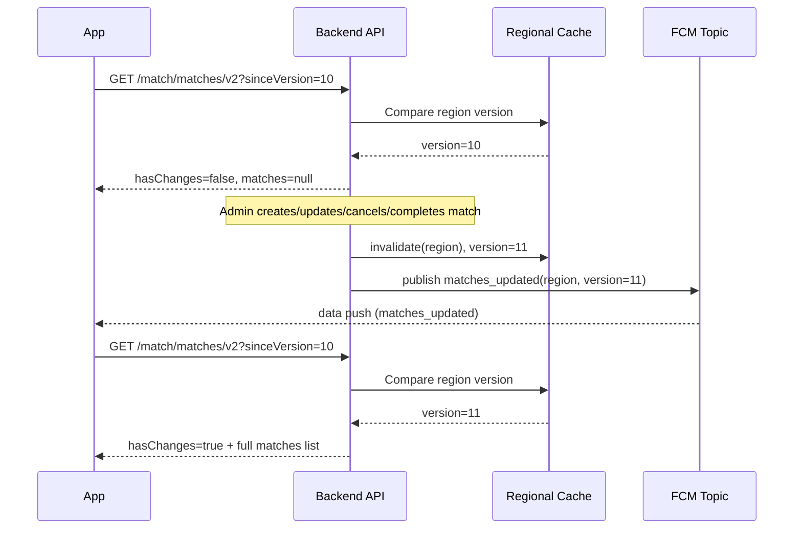

# Matches API

This document describes the API endpoints for match management.

## Common Concepts

### Authentication

All endpoints, unless otherwise indicated, are protected and require an access token.

-   **Required Header:** `Authorization: Bearer <access_token>`

### Responses

All endpoints return a standardized `AppResult` object.

-   **Success:** `{"status":"success","data":{...}}`
-   **Failure:** `{"status":"error","error":{...}}`

### Localization

To receive localized responses, include the `Accept-Language` header (e.g., `en-US`, `es-MX`).

---

## 1. Create Match

Creates a new scheduled match.

-   **Method:** `POST`
-   **Path:** `/match/admin/create`
-   **Required Role:** `ADMIN` or `ORGANIZER`

### Request Body

```json
{
    "fieldId": "a1b2c3d4-e5f6-7890-1234-567890abcdef",
    "supervisorId": "f1e2d3c4-b5a6-7890-1234-567890abcdef",
    "dateTime": 1715436000000,
    "dateTimeEnd": 1715439600000,
    "maxPlayers": 14,
    "minPlayersRequired": 10,
    "matchPriceInCents": 500,
    "discountIds": [],
    "status": "SCHEDULED",
    "genderType": "MIXED",
    "playerLevel": "ANY"
}
```

### Request Validation

| Field | Type | Required | Validation Rules |
|:------|:-----|:---------|:----------------|
| `fieldId` | UUID | Yes | Must be a valid UUID of an existing field. |
| `supervisorId` | UUID | No | Optional UUID of an admin/organizer to assign as match supervisor. Must be a valid user with role `ADMIN` or `ORGANIZER`. Defaults to the creator's ID. |
| `dateTime` | Long | Yes | Must be greater than 0. |
| `dateTimeEnd` | Long | Yes | Must be greater than `dateTime`. |
| `maxPlayers` | Int | Yes | Must be greater than 0. |
| `minPlayersRequired` | Int | Yes | Must be between 1 and `maxPlayers` (inclusive). |
| `matchPriceInCents` | Long | Yes | Must be greater than 0. Note: Value represents cents (e.g., 500 = $5.00). |
| `discountIds` | List\<UUID\> | No | Optional list of discount UUIDs applicable to the match. |
| `status` | Enum | No | Optional initial match status (e.g., `SCHEDULED`). Default: `SCHEDULED`. |
| `genderType` | Enum | No | Must be a valid `GenderType` value (e.g., `MIXED`, `MALE`, `FEMALE`). Default: `MIXED`. |
| `playerLevel` | Enum | No | Must be a valid `PlayerLevel` value (e.g., `BEGINNER`, `INTERMEDIATE`, `ADVANCED`, `ANY`). Default: `ANY`. |

### Pricing Validation

Before a match is created, the backend validates the economic scenario against the selected field and the active pricing policy:

- `maxPlayers` must be less than or equal to the field capacity.
- `minPlayersRequired` must be less than or equal to `maxPlayers`.
- `matchPriceInCents` is interpreted as **price per player**, not total match revenue.
- The selected price must not exceed the active `maxPricePerPlayerInCents`.
- The selected `minPlayersRequired` must be high enough to satisfy the calculated minimum profitable start threshold for that field, price, and `maxPlayers`.

If any of these rules fail, the request is rejected with `MATCH_PRICE_BELOW_PROFIT_TARGET` or `MATCH_FIELD_CAPACITY_EXCEEDED`.

### Economic Snapshot

When the match is created, the backend stores a pricing snapshot on the match record so future field/config changes do not affect historical analysis. The snapshot currently includes:

- field cost at creation time
- organizer fee at creation time
- minimum profit target used
- maximum price per player used
- FutMatch profit basis points used
- payment provider used
- payment percentage fee used
- payment fixed fee used
- pricing rounding step used

### Success Response

```json
{
    "status": "success",
    "data": {
        "id": "c3d4e5f6-a7b8-9012-3456-7890abcdef12",
        "fieldId": "a1b2c3d4-e5f6-7890-1234-567890abcdef",
        "supervisorId": "f1e2d3c4-b5a6-7890-1234-567890abcdef",
        "dateTime": 1715436000000,
        "dateTimeEnd": 1715439600000,
        "maxPlayers": 14,
        "minPlayersRequired": 10,
        "matchPriceInCents": 500,
        "discountPriceInCents": 0,
        "status": "SCHEDULED",
        "genderType": "MIXED",
        "playerLevel": "ANY"
    }
}
```

---

## 2. Update Match

Updates an existing match.

-   **Method:** `PUT`
-   **Path:** `/match/admin/update/{matchId}`
-   **Required Role:** `ADMIN` or `ORGANIZER`

### Path Parameters
-   `matchId` (UUID): The ID of the match to update.

### Request Body

```json
{
    "fieldId": "a1b2c3d4-e5f6-7890-1234-567890abcdef",
    "supervisorId": "f1e2d3c4-b5a6-7890-1234-567890abcdef",
    "dateTime": 1715436000000,
    "dateTimeEnd": 1715439600000,
    "maxPlayers": 14,
    "minPlayersRequired": 10,
    "matchPriceInCents": 600,
    "discountIds": [],
    "status": "SCHEDULED",
    "genderType": "MIXED",
    "playerLevel": "ANY"
}
```

### Request Validation

| Field | Type | Required | Validation Rules |
|:------|:-----|:---------|:----------------|
| `fieldId` | UUID | Yes | Must be a valid UUID of an existing field. |
| `supervisorId` | UUID | No | Optional UUID of an admin/organizer to assign as match supervisor. Must be a valid user with role `ADMIN` or `ORGANIZER`. |
| `dateTime` | Long | Yes | Must be greater than 0. |
| `dateTimeEnd` | Long | Yes | Must be greater than `dateTime`. |
| `maxPlayers` | Int | Yes | Must be greater than 0. |
| `minPlayersRequired` | Int | Yes | Must be between 1 and `maxPlayers` (inclusive). |
| `matchPriceInCents` | Long | Yes | Must be greater than 0. Note: Value represents cents (e.g., 500 = $5.00). |
| `discountIds` | List\<UUID\> | No | Optional list of discount UUIDs applicable to the match. |
| `status` | Enum | Yes | The new match status (e.g., `SCHEDULED`, `CANCELED`). |
| `genderType` | Enum | Yes | Must be a valid `GenderType` value (e.g., `MIXED`, `MALE`, `FEMALE`). |
| `playerLevel` | Enum | Yes | Must be a valid `PlayerLevel` value (e.g., `BEGINNER`, `INTERMEDIATE`, `ADVANCED`, `ANY`). |

### Pricing Validation

Update uses the same pricing rules as create:

- `maxPlayers <= field.capacity`
- `minPlayersRequired <= maxPlayers`
- the custom price must stay within the active pricing cap
- the selected minimum players must satisfy the calculated profitable threshold

If the update passes validation, the economic snapshot on the match is refreshed using the current field/config values.

### Success Response

```json
{
    "status": "success",
    "data": {
        "id": "c3d4e5f6-a7b8-9012-3456-7890abcdef12",
        "fieldId": "a1b2c3d4-e5f6-7890-1234-567890abcdef",
        "supervisorId": "f1e2d3c4-b5a6-7890-1234-567890abcdef",
        "dateTime": 1715436000000,
        "dateTimeEnd": 1715439600000,
        "maxPlayers": 14,
        "minPlayersRequired": 10,
        "matchPriceInCents": 600,
        "discountPriceInCents": 0,
        "status": "SCHEDULED",
        "genderType": "MIXED",
        "playerLevel": "ANY"
    }
}
```

---

## Match Pricing Endpoints

These endpoints are used by admin pricing flows before creating/updating the match. They are **field-scoped** and currently **ADMIN only**.

### A. Pricing Estimate

Returns suggested pricing options, operational insights, the recommended option, and the selected breakdown for a specific field and chosen `maxPlayers`.

- **Method:** `POST`
- **Path:** `/fields/{fieldId}/pricing-estimate`
- **Required Role:** `ADMIN`

#### Request Body

```json
{
  "maxPlayers": 10
}
```

#### Request Rules

- `fieldId` must exist.
- `maxPlayers` must be between `1` and `field.capacity`.
- Suggested `pricingOptions` use the configured UI step.
- If `maxPricePerPlayerInCents` does not align with that step, the backend still appends the exact max price as the last option.

#### Success Response Example

```json
{
  "status": "success",
  "data": {
    "fieldId": "2f6a1c1e-7f2f-4f90-9d95-0c1f0d7d1001",
    "fieldName": "Cancha Centro 14",
    "fieldCapacity": 14,
    "maxPlayers": 10,
    "fieldCostInCents": 80000,
    "organizerFeeInCents": 20000,
    "currency": "MXN",
    "constraints": {
      "minimumProfitInCents": 30000,
      "maxPricePerPlayerInCents": 22000,
      "priceStepInCents": 1000,
      "stripePercentFeeBps": 360,
      "stripeFixedFeeCents": 300,
      "futmatchProfitBps": 1500,
      "usesFieldOverrides": false
    },
    "operationalInsights": {
      "breakEvenPlayersRequired": 8,
      "recommendedMinimumPlayersToStart": 10
    },
    "recommendedOption": {
      "pricePerPlayerInCents": 17000,
      "breakEvenPlayersRequired": 8,
      "minimumPlayersToStart": 10,
      "estimatedProfitAtMinimumPlayersInCents": 60880,
      "estimatedProfitAtFullCapacityInCents": 60880,
      "isViable": true,
      "isRecommended": true,
      "label": "RECOMMENDED",
      "breakdownAtMinimumPlayersToStart": {
        "players": 10,
        "grossRevenueInCents": 170000,
        "stripeFixedFeeInCents": 3000,
        "stripePercentFeeInCents": 6120,
        "totalStripeFeesInCents": 9120,
        "netRevenueInCents": 160880,
        "fieldCostInCents": 80000,
        "organizerFeeInCents": 20000,
        "targetProfitInCents": 30000,
        "estimatedProfitInCents": 60880
      },
      "breakdownAtFullCapacity": {
        "players": 10,
        "grossRevenueInCents": 170000,
        "stripeFixedFeeInCents": 3000,
        "stripePercentFeeInCents": 6120,
        "totalStripeFeesInCents": 9120,
        "netRevenueInCents": 160880,
        "fieldCostInCents": 80000,
        "organizerFeeInCents": 20000,
        "targetProfitInCents": 30000,
        "estimatedProfitInCents": 60880
      }
    },
    "pricingOptions": [],
    "selectedOption": {
      "pricePerPlayerInCents": 17000,
      "breakEvenPlayersRequired": 8,
      "minimumPlayersToStart": 10,
      "estimatedProfitAtMinimumPlayersInCents": 60880,
      "estimatedProfitAtFullCapacityInCents": 60880,
      "isViable": true,
      "isRecommended": true,
      "label": "RECOMMENDED",
      "breakdownAtMinimumPlayersToStart": {
        "players": 10,
        "grossRevenueInCents": 170000,
        "stripeFixedFeeInCents": 3000,
        "stripePercentFeeInCents": 6120,
        "totalStripeFeesInCents": 9120,
        "netRevenueInCents": 160880,
        "fieldCostInCents": 80000,
        "organizerFeeInCents": 20000,
        "targetProfitInCents": 30000,
        "estimatedProfitInCents": 60880
      },
      "breakdownAtFullCapacity": {
        "players": 10,
        "grossRevenueInCents": 170000,
        "stripeFixedFeeInCents": 3000,
        "stripePercentFeeInCents": 6120,
        "totalStripeFeesInCents": 9120,
        "netRevenueInCents": 160880,
        "fieldCostInCents": 80000,
        "organizerFeeInCents": 20000,
        "targetProfitInCents": 30000,
        "estimatedProfitInCents": 60880
      }
    }
  }
}
```

> `pricingOptions` normally contains multiple suggested prices. It is shortened in the example above.

### B. Custom Pricing

Calculates a single custom scenario for an explicit price chosen by the admin.

- **Method:** `POST`
- **Path:** `/fields/{fieldId}/pricing-custom`
- **Required Role:** `ADMIN`

#### Request Body

```json
{
  "maxPlayers": 10,
  "pricePerPlayerInCents": 14500
}
```

#### Request Rules

- `fieldId` must exist.
- `maxPlayers` must be between `1` and `field.capacity`.
- `pricePerPlayerInCents` must be greater than `0`.

#### Success Response Example

```json
{
  "status": "success",
  "data": {
    "fieldId": "2f6a1c1e-7f2f-4f90-9d95-0c1f0d7d1001",
    "fieldName": "Cancha Centro 14",
    "fieldCapacity": 14,
    "maxPlayers": 10,
    "pricePerPlayerInCents": 14500,
    "currency": "MXN",
    "constraints": {
      "minimumProfitInCents": 30000,
      "maxPricePerPlayerInCents": 22000,
      "priceStepInCents": 1000,
      "stripePercentFeeBps": 360,
      "stripeFixedFeeCents": 300,
      "futmatchProfitBps": 1500,
      "usesFieldOverrides": false
    },
    "result": {
      "pricePerPlayerInCents": 14500,
      "breakEvenPlayersRequired": 8,
      "minimumPlayersToStart": 10,
      "estimatedProfitAtMinimumPlayersInCents": 36780,
      "estimatedProfitAtFullCapacityInCents": 36780,
      "isViable": true,
      "isRecommended": false,
      "label": "CUSTOM",
      "breakdownAtMinimumPlayersToStart": {
        "players": 10,
        "grossRevenueInCents": 145000,
        "stripeFixedFeeInCents": 3000,
        "stripePercentFeeInCents": 5220,
        "totalStripeFeesInCents": 8220,
        "netRevenueInCents": 136780,
        "fieldCostInCents": 80000,
        "organizerFeeInCents": 20000,
        "targetProfitInCents": 30000,
        "estimatedProfitInCents": 36780
      },
      "breakdownAtFullCapacity": {
        "players": 10,
        "grossRevenueInCents": 145000,
        "stripeFixedFeeInCents": 3000,
        "stripePercentFeeInCents": 5220,
        "totalStripeFeesInCents": 8220,
        "netRevenueInCents": 136780,
        "fieldCostInCents": 80000,
        "organizerFeeInCents": 20000,
        "targetProfitInCents": 30000,
        "estimatedProfitInCents": 36780
      }
    }
  }
}
```

### Pricing Semantics

- `breakEvenPlayersRequired`: minimum players needed so the match does not lose money.
- `minimumPlayersToStart`: minimum players needed to satisfy the active profit target.
- `estimatedProfitAtMinimumPlayersInCents`: projected profit if only the minimum start threshold is reached.
- `estimatedProfitAtFullCapacityInCents`: projected profit if the match fills to the selected `maxPlayers`.
- `breakdownAtMinimumPlayersToStart`: detailed breakdown for the minimum start threshold.
- `breakdownAtFullCapacity`: detailed breakdown for the full match (`maxPlayers`).
- `usesFieldOverrides`: tells the client whether global config was overridden by field-specific pricing settings.
- `priceStepInCents`: UI step for suggested price chips.

---

## 3. Complete Match

Registers the final result of a match, including player goals, external team goals, and the best player (MVP).

-   **Method:** `POST`
-   **Path:** `/match/admin/{matchId}/complete`
-   **Required Role:** `ADMIN` or `ORGANIZER`

### Path Parameters
-   `matchId` (UUID): The ID of the match to complete.

### Request Body

```json
{
    "goals": [
        {
            "userId": "a1b2c3d4-e5f6-7890-1234-567890abcdef",
            "goals": 2
        },
        {
            "userId": "b2c3d4e5-f6a7-8901-2345-67890abcdef1",
            "goals": 1
        }
    ],
    "externalGoals": [
        {
            "team": "A",
            "goals": 1
        },
        {
            "team": "B",
            "goals": 0
        }
    ],
    "bestPlayerId": "a1b2c3d4-e5f6-7890-1234-567890abcdef"
}
```

### Request Validation

| Field | Type | Required | Validation Rules |
|:------|:-----|:---------|:----------------|
| `goals` | List | Yes | User goal entries. `goals` or `externalGoals` must contain at least one entry. |
| `goals[].userId` | UUID | Yes | Must be a valid UUID of a user enrolled in the match. |
| `goals[].goals` | Int | Yes | Must be >= 0. |
| `externalGoals` | List | No | Goals scored by players outside the app, grouped by team. Defaults to an empty list. |
| `externalGoals[].team` | Enum | Yes | Supported values: `A`, `B`. |
| `externalGoals[].goals` | Int | Yes | Must be >= 0. These goals affect only the final team score. |
| `bestPlayerId` | UUID | Yes | Must be a valid UUID of a user enrolled in the match. |

> `goals[].isBestPlayer` is not supported. Use only `bestPlayerId` at the root of the payload.

> External players are not returned by any backend endpoint and are not persisted as users. The client UI should render local controls such as "External Team A" and "External Team B", then send those values through `externalGoals`.

> `externalGoals` are added to `match_results.team_a_score` and `match_results.team_b_score`. They are not stored in `match_player_goals`, do not belong to any user, and do not affect individual player statistics.

### Completion Notifications

When a match is completed, all enrolled players receive a push notification with `fieldName` and final score:

- Winner players: congratulation message.
- Winner + MVP (`bestPlayerId`): combined congratulation + MVP message.
- Losing players: neutral finished-match message.
- Draw: neutral draw message for all players.

### Success Response

```json
{
    "status": "success",
    "data": true
}
```

### Error Codes

| Code | Description |
|:-----|:------------|
| `MATCH_NOT_FOUND` | The specified match does not exist. |
| `MATCH_ALREADY_COMPLETED` | The match has already been completed. |
| `INVALID_BEST_PLAYER` | The specified best player is not enrolled in the match. |

---

## 4. Cancel Match

Cancels a scheduled match. This endpoint handles payment refunds and cancellations for all players enrolled in the match.

**Behavior:**
- `RESERVED` players: Removed from match, notification sent (no charge).
- `JOINED` + `AUTHORIZED/CREATED` payments: Active payments are cancelled in Stripe.
- `JOINED` + `SUCCEEDED` payments: Refund is initiated for each successful captured payment associated with the active player. If refund fails, it is recorded for retry.
- Historical `CANCELED` and `REFUNDED` payments are ignored.
- Active players receive a single cancellation push notification based on the effective refund outcome for that user. The notification body and metadata include the cancellation reason.
- The cancellation reason is persisted on the match (`cancel_reason`).
- Completed matches cannot be canceled.

-   **Method:** `PATCH`
-   **Path:** `/match/admin/cancel/{matchId}`
-   **Required Role:** `ADMIN` or `ORGANIZER`

### Path Parameters
-   `matchId` (UUID): The ID of the match to cancel.

### Request Body

```json
{
    "reason": "No se completó el número mínimo de jugadores."
}
```

### Request Validation

| Field | Type | Required | Validation Rules |
|:------|:-----|:---------|:----------------|
| `reason` | String | Yes | Free text explaining why the match was canceled. Trimmed before validation. Must not be blank and must be 300 characters or less. |

### cURL

```bash
curl --location --request PATCH '{{base_url}}/match/admin/cancel/{matchId}' \
--header 'Authorization: Bearer {{token}}' \
--header 'Content-Type: application/json' \
--data '{
    "reason": "No se completó el número mínimo de jugadores."
}'
```

### Success Response

```json
{
    "status": "success",
    "data": {
        "canceled": true,
        "totalPlayers": 10,
        "playersRemoved": 2,
        "paymentsCancelled": 3,
        "refundsIssued": 4,
        "refundFailures": [
            {
                "failureId": "uuid",
                "userId": "uuid",
                "paymentId": "uuid",
                "errorMessage": "Refund failed in Stripe"
            }
        ]
    }
}
```

### Response Fields

| Field | Type | Description |
|:------|:-----|:------------|
| `canceled` | Boolean | Whether the match was successfully canceled. |
| `totalPlayers` | Int | Total players enrolled in the match. |
| `playersRemoved` | Int | Number of RESERVED players removed. |
| `paymentsCancelled` | Int | Number of AUTHORIZED/CREATED payments cancelled. |
| `refundsIssued` | Int | Number of successful refunds processed. |
| `refundFailures` | List | List of failed refunds that need manual retry. |

### Push Notifications Sent

| Player Status | Payment Status | Notification |
|:--------------|:---------------|:------------|
| `RESERVED` | N/A | "Match canceled. No charge was made." |
| `JOINED` | `SUCCEEDED` (refund success) | "Match canceled. Refund initiated." |
| `JOINED` | `SUCCEEDED` (refund failed) | "Match canceled. Contact support for refund." |
| `JOINED` | `AUTHORIZED/CREATED` | "Match canceled. Charge released." |
| `JOINED` | no actionable payment | "Match canceled. No charge was made." |

### Error Codes

| Code | Description |
|:-----|:------------|
| `MATCH_NOT_FOUND` | The specified match does not exist. |
| `MATCH_ALREADY_COMPLETED` | The match was already completed and can no longer be canceled. |

---

## 5. Rebalance Match Teams

Allows an `ADMIN` or `ORGANIZER` to rebalance players between teams for drag-and-drop team leveling.

-   **Method:** `POST`
-   **Path:** `/match/admin/{matchId}/rebalance-teams`
-   **Required Role:** `ADMIN` or `ORGANIZER`

### Path Parameters
-   `matchId` (UUID): The ID of the match to rebalance.

### Request Body

```json
{
    "players": [
        {
            "userId": "a1b2c3d4-e5f6-7890-1234-567890abcdef",
            "team": "A"
        },
        {
            "userId": "b2c3d4e5-f6a7-8901-2345-67890abcdef1",
            "team": "B"
        }
    ]
}
```

### Behavior

- Supports swapping two players between teams by sending two reassignment items.
- Supports moving a single player into an available spot on the other team by sending one reassignment item.
- Only active players (`JOINED` or `RESERVED`) can be reassigned.
- Only `SCHEDULED` matches can be rebalanced.
- The resulting assignment cannot exceed `maxPlayers / 2` on either team.
- On success, both DB and Firestore match projections are updated.

### Success Response

```json
{
    "status": "success",
    "data": true
}
```

### Error Codes

| Code | Description |
|:-----|:------------|
| `MATCH_NOT_FOUND` | The specified match does not exist. |
| `MATCH_NOT_SCHEDULED` | Only scheduled matches can be rebalanced. |
| `MATCH_INVALID_REBALANCE_PLAYERS` | One or more requested players are not active in the match. |
| `MATCH_REBALANCE_TEAM_LIMIT` | The requested rebalance would exceed the per-team limit. |

---

## 6. Get Matches by Field

Gets a list of matches associated with a specific field.

-   **Method:** `GET`
-   **Path:** `/match/admin/matches/{fieldId}`
-   **Required Role:** `ADMIN` or `ORGANIZER`

### Path Parameters
-   `fieldId` (UUID): The ID of the field.

### Success Response

```json
{
    "status": "success",
    "data": [
        {
            "matchId": "c3d4e5f6-a7b8-9012-3456-7890abcdef12",
            "fieldId": "a1b2c3d4-e5f6-7890-1234-567890abcdef",
            "fieldName": "Cancha Central",
            "fieldLocation": {
                "id": "b2c3d4e5-f6a7-8901-2345-67890abcdef1",
                "address": "123 Calle Falsa",
                "cityCode": "MX_CDMX",
                "countryCode": "MX",
                "latitude": 40.7128,
                "longitude": -74.0060
            },
            "matchDateTime": 1715436000000,
            "matchDateTimeEnd": 1715439600000,
            "matchPriceInCents": 500,
            "discountInCents": 0,
            "maxPlayers": 14,
            "enrolledPlayers": 9,
            "minPlayersRequired": 10,
            "status": "SCHEDULED",
            "footwearType": "TURF",
            "fieldType": "SYNTHETIC",
            "hasParking": true,
            "fieldImages": [
                {
                    "id": "img-uuid-1",
                    "fieldId": "a1b2c3d4-e5f6-7890-1234-567890abcdef",
                    "imagePath": "https://res.cloudinary.com/.../image1.jpg",
                    "position": 0
                },
                {
                    "id": "img-uuid-2",
                    "fieldId": "a1b2c3d4-e5f6-7890-1234-567890abcdef",
                    "imagePath": "https://res.cloudinary.com/.../image2.jpg",
                    "position": 1
                }
            ],
            "genderType": "MIXED",
            "playerLevel": "ANY"
        }
    ]
}
```

### Notes
-   `enrolledPlayers` represents the current number of players enrolled in the match (`RESERVED` + `JOINED`).

---

## 7. Get All Matches

Gets a list of all available matches.

-   **Method:** `GET`
-   **Path:** `/match/admin/matches`
-   **Required Role:** `ADMIN` or `ORGANIZER`

### Success Response

```json
{
    "status": "success",
    "data": [
        {
            "matchId": "c3d4e5f6-a7b8-9012-3456-7890abcdef12",
            "fieldId": "a1b2c3d4-e5f6-7890-1234-567890abcdef",
            "fieldName": "Cancha Central",
            "fieldLocation": {
                "id": "b2c3d4e5-f6a7-8901-2345-67890abcdef1",
                "address": "123 Calle Falsa",
                "cityCode": "MX_CDMX",
                "countryCode": "MX",
                "latitude": 40.7128,
                "longitude": -74.0060
            },
            "matchDateTime": 1715436000000,
            "matchDateTimeEnd": 1715439600000,
            "matchPriceInCents": 500,
            "discountInCents": 0,
            "maxPlayers": 14,
            "enrolledPlayers": 9,
            "minPlayersRequired": 10,
            "status": "SCHEDULED",
            "footwearType": "TURF",
            "fieldType": "SYNTHETIC",
            "hasParking": true,
            "fieldImages": [
                {
                    "id": "img-uuid-1",
                    "fieldId": "a1b2c3d4-e5f6-7890-1234-567890abcdef",
                    "imagePath": "https://res.cloudinary.com/.../image1.jpg",
                    "position": 0
                },
                {
                    "id": "img-uuid-2",
                    "fieldId": "a1b2c3d4-e5f6-7890-1234-567890abcdef",
                    "imagePath": "https://res.cloudinary.com/.../image2.jpg",
                    "position": 1
                }
            ],
            "genderType": "MIXED",
            "playerLevel": "ANY"
        }
    ]
}
```

---

## 8. Get Matches for Players

Gets a list of available matches for players, optionally filtered by location.

-   **Method:** `GET`
-   **Path:** `/match/matches`
-   **Required Role:** `PLAYER`, `ADMIN`, or `ORGANIZER`

### Short Explanation

This endpoint returns the public regional match list already filtered by the authenticated user's visibility rules:
- Backend reads the authenticated user's `gender` and `level`.
- Backend filters regional public matches by `genderType` and `playerLevel`.
- Backend sorts the visible list by time and optional distance.

### Visibility Rules

- Gender:
  - `MALE` sees `MIXED` and `MALE_ONLY`
  - `FEMALE` sees `MIXED` and `FEMALE_ONLY`
  - `OTHER` sees only `MIXED`
- Level:
  - `ANY` matches are visible to everyone
  - Visibility is hierarchical ascending:
    - `BEGINNER` sees `ANY` and `BEGINNER`
    - `INTERMEDIATE` sees `ANY`, `BEGINNER`, `INTERMEDIATE`
    - `ADVANCED` sees `ANY`, `BEGINNER`, `INTERMEDIATE`, `ADVANCED`
    - `PROFESSIONAL` sees all levels

### Query Parameters
-   `lat` (Double, Optional): Latitude for proximity search.
-   `lon` (Double, Optional): Longitude for proximity search.

### Success Response

```json
{
    "status": "success",
    "data": [
        {
            "id": "c3d4e5f6-a7b8-9012-3456-7890abcdef12",
            "fieldName": "Cancha Central",
            "fieldImages": [
                {
                    "id": "img-uuid-1",
                    "fieldId": "a1b2c3d4-e5f6-7890-1234-567890abcdef",
                    "imagePath": "https://res.cloudinary.com/.../image1.jpg",
                    "position": 0
                },
                {
                    "id": "img-uuid-2",
                    "fieldId": "a1b2c3d4-e5f6-7890-1234-567890abcdef",
                    "imagePath": "https://res.cloudinary.com/.../image2.jpg",
                    "position": 1
                }
            ],
            "startTime": 1715436000000,
            "endTime": 1715439600000,
            "originalPriceInCents": 500,
            "totalDiscountInCents": 0,
            "priceInCents": 500,
            "genderType": "MIXED",
            "playerLevel": "INTERMEDIATE",
            "status": "SCHEDULED",
            "availableSpots": 4,
            "teams": {
                "teamA": {
                    "playerCount": 5,
                    "players": [
                        {
                            "id": "user-uuid-1",
                            "avatarUrl": "https://example.com/avatar1.jpg",
                            "gender": "MALE",
                            "name": "Juan Perez",
                            "country": "MX",
                            "status": "JOINED"
                        }
                    ]
                },
                "teamB": {
                    "playerCount": 5,
                    "players": [
                        {
                            "id": "user-uuid-2",
                            "avatarUrl": null,
                            "gender": "FEMALE",
                            "name": "Maria Lopez",
                            "country": "MX",
                            "status": "JOINED"
                        }
                    ]
                }
            },
            "location": {
                "id": "b2c3d4e5-f6a7-8901-2345-67890abcdef1",
                "address": "123 Calle Falsa",
                "cityCode": "MX_CDMX",
                "countryCode": "MX",
                "latitude": 40.7128,
                "longitude": -74.0060
            }
        }
    ]
}
```

---

## 8.1 Get Matches for Players (V2 - Versioned Cache)

Returns public matches with version control to avoid downloading the full list when nothing changed.

-   **Method:** `GET`
-   **Path:** `/match/matches/v2`
-   **Required Role:** `PLAYER`, `ADMIN`, or `ORGANIZER`

### Short Explanation

This endpoint is optimized for app refresh:
- Client sends `sinceVersion` (last local version).
- Backend compares against the current visible version for the authenticated user.
- If version is unchanged: returns lightweight payload (`hasChanges=false`) without list.
- If version changed: returns full list and new version.
- The full list includes team/player data (`teams.teamA.players`, `teams.teamB.players`), fixed capacity (`maxPlayers`), current snapshot (`availableSpots`), and match visibility metadata (`genderType`, `playerLevel`).

The visible version is derived from:
- regional cache version
- authenticated user's current `gender`
- authenticated user's current `level`

This means `currentVersion` is an opaque version for the authenticated user's visible list. Clients must persist and resend it exactly as received.

### Visibility Rules

- The same visibility rules described in section `8. Get Matches for Players` apply.
- Backend reads the authenticated user's current profile on every request.
- If the user's `gender` or `level` changes, the visible version changes even if the regional cache version stays the same.

### Query Parameters
-   `sinceVersion` (Long, Optional): Client local version.
-   `countryCode` (String, Optional): Region country code. Example: `MX`.
-   `stateCode` (String, Optional): Region/state code. Example: `CDMX`.
-   `lat` (Double, Optional): Latitude for distance sort.
-   `lon` (Double, Optional): Longitude for distance sort.

> If `countryCode/stateCode` are omitted, backend uses default region `MX:CDMX`.

### Success Response (No Changes)

```json
{
    "status": "success",
    "data": {
        "region": "MX:CDMX",
        "currentVersion": 2595,
        "hasChanges": false,
        "matches": null
    }
}
```

### Success Response (Changed)

```json
{
    "status": "success",
    "data": {
        "region": "MX:CDMX",
        "currentVersion": 2596,
        "hasChanges": true,
        "matches": [
            {
                "id": "c3d4e5f6-a7b8-9012-3456-7890abcdef12",
                "fieldName": "Cancha Central",
                "fieldImages": [
                    {
                        "id": "img-uuid-1",
                        "fieldId": "a1b2c3d4-e5f6-7890-1234-567890abcdef",
                        "imagePath": "https://res.cloudinary.com/.../image1.jpg",
                        "position": 0
                    }
                ],
                "startTime": 1715436000000,
                "endTime": 1715439600000,
                "originalPriceInCents": 500,
                "totalDiscountInCents": 0,
                "priceInCents": 500,
                "genderType": "MIXED",
                "playerLevel": "INTERMEDIATE",
                "status": "SCHEDULED",
                "maxPlayers": 14,
                "availableSpots": 4,
                "teams": {
                    "teamA": {
                        "playerCount": 5,
                        "players": [
                            {
                                "id": "user-uuid-1",
                                "avatarUrl": "https://example.com/avatar1.jpg",
                                "gender": "MALE",
                                "name": "Juan Perez",
                                "country": "MX",
                                "status": "JOINED"
                            }
                        ]
                    },
                    "teamB": {
                        "playerCount": 5,
                        "players": [
                            {
                                "id": "user-uuid-2",
                                "avatarUrl": null,
                                "gender": "FEMALE",
                                "name": "Maria Lopez",
                                "country": "MX",
                                "status": "JOINED"
                            }
                        ]
                    }
                },
                "location": {
                    "id": "b2c3d4e5-f6a7-8901-2345-67890abcdef1",
                    "address": "123 Calle Falsa",
                    "cityCode": "MX_CDMX",
                    "countryCode": "MX",
                    "latitude": 40.7128,
                    "longitude": -74.0060
                }
            }
        ]
    }
}
```

### Capacity Contract

- `maxPlayers` is the fixed total capacity configured for the match.
- `maxPlayers` does not change when players join, reserve, cancel or leave.
- `availableSpots` remains a backend snapshot value for convenience, but frontend should treat `maxPlayers` as the source of truth for fixed capacity.

Expected frontend usage for list responses (`/match/matches/v2`):

```text
availableSpots = maxPlayers - (teams.teamA.playerCount + teams.teamB.playerCount)
spotsPerTeam = maxPlayers / 2
missingTeamA = spotsPerTeam - teams.teamA.playerCount
missingTeamB = spotsPerTeam - teams.teamB.playerCount
```

### Invalidation Rules

Regional cache/version is invalidated on:
- `create match`
- `update match`
- `cancel match`
- `complete match`
- `join match`
- `leave match`

### Regional Push Behavior

Push for auto-refresh is sent only for:
- `create`
- `update`
- `cancel`
- `complete`

`join/leave` still invalidate cache/version, but do not trigger regional push.

Topic format:
- `matches_<COUNTRY>_<STATE>` (example: `matches_MX_CDMX`)

Push data payload:
- `type=matches_updated`
- `region=MX:CDMX`
- `version=<regionalVersion>`

Important:
- Push `version` is the regional version only.
- Response `currentVersion` from `/match/matches/v2` is the visible version for the authenticated user.
- Clients must not overwrite local `currentVersion` with push `version`.

### Client Integration Flow

1. On app open (or screen open), call `GET /match/matches/v2?sinceVersion=<localVersion>`.
2. If `hasChanges=false`, keep current UI list.
3. If `hasChanges=true`, replace full list and persist `currentVersion`.
4. On regional push (`matches_updated`), call V2 again with current local `sinceVersion`.
5. Keep swipe-to-refresh as manual fallback.

### ASCII Flow

```text
READ FLOW

[Client]
   |
   | GET /match/matches/v2?sinceVersion=10
   v
[Backend]
   |
   | resolve region (example: MX:CDMX)
   | read regional version from DB
   | compare client version vs backend version
   |
   +--> same version
   |      |
   |      +--> response: hasChanges=false, matches=null
   |
   +--> different version
          |
          | use/rebuild in-memory payload cache for region
          +--> response: hasChanges=true, currentVersion=11, matches=[...]


UPDATE FLOW

[Create / Update / Cancel / Complete / Join / Leave]
   |
   +--> increment regional version in DB
   |
   +--> clear in-memory payload cache for region
   |
   +--> if event is Create / Update / Cancel / Complete
   |       |
   |       +--> send regional data-only push: matches_updated
   |
   +--> if event is Join / Leave
           |
           +--> no regional push
```

### Sequence Diagram



---

## 9. Get My Matches (User's Enrolled Matches)

Gets a list of matches where the authenticated user is enrolled (status: `RESERVED` or `JOINED`).

-   **Method:** `GET`
-   **Path:** `/match/my-matches`
-   **Required Role:** `PLAYER`, `ADMIN` or `ORGANIZER`

### Query Parameters
-   `lat` (Double, Optional): Latitude for proximity sort.
-   `lon` (Double, Optional): Longitude for proximity sort.

### Match Visibility Rules

Matches are returned based on the following rules:

| Match Status | Visibility |
|:------------|:-----------|
| `SCHEDULED` | Always shown |
| `IN_PROGRESS` | Always shown |
| `COMPLETED` | Shown if ended within the last **4 days** |
| `CANCELED` | Shown if ended within the last **4 days** |

After 4 days from `dateTimeEnd`, completed/canceled matches will no longer appear in the response.

### Success Response

```json
{
    "status": "success",
    "data": [
        {
            "id": "c3d4e5f6-a7b8-9012-3456-7890abcdef12",
            "fieldName": "Cancha Central",
            "fieldImages": [
                {
                    "id": "img-uuid-1",
                    "fieldId": "a1b2c3d4-e5f6-7890-1234-567890abcdef",
                    "imagePath": "https://res.cloudinary.com/.../image1.jpg",
                    "position": 0
                }
            ],
            "startTime": 1715436000000,
            "endTime": 1715439600000,
            "originalPriceInCents": 500,
            "totalDiscountInCents": 0,
            "priceInCents": 500,
            "genderType": "MIXED",
            "status": "SCHEDULED",
            "maxPlayers": 14,
            "availableSpots": 4,
            "teams": {
                "teamA": {
                    "playerCount": 5,
                    "players": [
                        {
                            "id": "user-uuid-1",
                            "avatarUrl": "https://example.com/avatar1.jpg",
                            "gender": "MALE",
                            "name": "Juan Perez",
                            "country": "MX",
                            "status": "JOINED"
                        }
                    ]
                },
                "teamB": {
                    "playerCount": 5,
                    "players": [
                        {
                            "id": "user-uuid-2",
                            "avatarUrl": null,
                            "gender": "FEMALE",
                            "name": "Maria Lopez",
                            "country": "MX",
                            "status": "JOINED"
                        }
                    ]
                }
            },
            "location": {
                "id": "b2c3d4e5-f6a7-8901-2345-67890abcdef1",
                "address": "123 Calle Falsa",
                "cityCode": "MX_CDMX",
                "countryCode": "MX",
                "latitude": 40.7128,
                "longitude": -74.0060
            }
        }
    ]
}
```

### Capacity Contract

- `maxPlayers` is the fixed total capacity configured for the match.
- `maxPlayers` does not change when players join, reserve, cancel or leave.
- In `/match/my-matches`, frontend should calculate team slots from `maxPlayers` plus the response snapshot.

Expected frontend usage for list responses (`/match/my-matches`):

```text
availableSpots = maxPlayers - (teams.teamA.playerCount + teams.teamB.playerCount)
spotsPerTeam = maxPlayers / 2
missingTeamA = spotsPerTeam - teams.teamA.playerCount
missingTeamB = spotsPerTeam - teams.teamB.playerCount
```

---

## 10. Get Match Detail

Gets complete details of a specific match.

-   **Method:** `GET`
-   **Path:** `/match/{matchId}`
-   **Required Role:** Public (or Authenticated)

### Path Parameters
-   `matchId` (UUID): The ID of the match.

### Success Response

```json
{
    "status": "success",
    "data": {
        "id": "c3d4e5f6-a7b8-9012-3456-7890abcdef12",
        "fieldName": "Cancha Central",
        "fieldImages": [
            {
                "id": "img-uuid-1",
                "fieldId": "a1b2c3d4-e5f6-7890-1234-567890abcdef",
                "imagePath": "https://res.cloudinary.com/.../image1.jpg",
                "position": 0
            },
            {
                "id": "img-uuid-2",
                "fieldId": "a1b2c3d4-e5f6-7890-1234-567890abcdef",
                "imagePath": "https://res.cloudinary.com/.../image2.jpg",
                "position": 1
            }
        ],
        "startTime": 1715436000000,
        "endTime": 1715439600000,
        "originalPriceInCents": 500,
        "totalDiscountInCents": 0,
        "priceInCents": 500,
        "genderType": "MIXED",
        "status": "SCHEDULED",
        "teamAScore": null,
        "teamBScore": null,
        "maxPlayers": 14,
        "availableSpots": 4,
        "teams": {
            "teamA": {
                "playerCount": 5,
                "players": [
                    {
                        "id": "user-uuid-1",
                        "avatarUrl": "https://example.com/avatar1.jpg",
                        "gender": "MALE",
                        "name": "Juan Perez",
                        "country": "MX",
                        "status": "JOINED"
                    }
                ]
            },
            "teamB": {
                "playerCount": 5,
                "players": [
                    {
                        "id": "user-uuid-2",
                        "avatarUrl": null,
                        "gender": "FEMALE",
                        "name": "Maria Lopez",
                        "country": "MX",
                        "status": "JOINED"
                    }
                ]
            }
        },
        "location": {
            "id": "b2c3d4e5-f6a7-8901-2345-67890abcdef1",
            "address": "123 Calle Falsa",
            "cityCode": "MX_CDMX",
            "countryCode": "MX",
            "latitude": 40.7128,
            "longitude": -74.0060
        },
        "footwearType": "TURF",
        "fieldType": "SYNTHETIC",
        "hasParking": true,
        "extraInfo": "Por favor llegar 15 minutos antes",
        "description": "Partido amistoso semanal",
        "rules": "No se permiten tacos de metal"
    }
}
```

### Score Fields

- `teamAScore` and `teamBScore` are returned only when `status = COMPLETED`.
- For `SCHEDULED`, `IN_PROGRESS`, or `CANCELED` matches, both fields are `null`.
- Scores come from the final result saved by an admin/organizer when completing the match.

### Team Snapshot Contract

- For `SCHEDULED` and `IN_PROGRESS`, detail consumers should continue using the realtime player source for live roster rendering.
- For `CANCELED` and `COMPLETED`, the backend now returns `teams` populated directly in the detail response.
- In final states, clients should treat the backend `teams` snapshot as the source of truth and do not need to query Firestore for players.

Example for a completed match:

```json
{
    "id": "c3d4e5f6-a7b8-9012-3456-7890abcdef12",
    "status": "COMPLETED",
    "teamAScore": 4,
    "teamBScore": 2
}
```

### Capacity Contract

- `maxPlayers` is the fixed total capacity configured for the match.
- `maxPlayers` does not change when players join, reserve, cancel or leave.
- In detail, frontend should use `maxPlayers` together with realtime Firestore players instead of inferring total capacity from `availableSpots`.

Expected frontend usage for detail responses (`/match/{matchId}` + Firestore realtime):

```text
availableSpots = maxPlayers - firestorePlayers.size
spotsPerTeam = maxPlayers / 2
missingTeamA = spotsPerTeam - firestoreTeamAPlayers.size
missingTeamB = spotsPerTeam - firestoreTeamBPlayers.size
```

For final states (`CANCELED`, `COMPLETED`), the frontend can skip Firestore player loading and render the `teams` object returned by backend.

---

## 11. Join Match

Allows a user to join a match. This will reserve a spot and initiate the payment flow.

-   **Method:** `POST`
-   **Path:** `/match/{matchId}/join`
-   **Required Role:** `PLAYER`, `ADMIN` or `ORGANIZER`

### Path Parameters
-   `matchId` (UUID): The ID of the match to join.

### Request Body

```json
{
    "team": "A",
    "paymentProvider": "STRIPE"
}
```

### Request Validation

| Field | Type | Required | Validation Rules |
|:------|:-----|:---------|:----------------|
| `team` | Enum | No | Must be a valid `TeamType` value (`A` or `B`). If null, the system will auto-assign for balance. |
| `paymentProvider` | Enum | No | Payment provider to use (e.g., `STRIPE`). Default: `STRIPE`. |

### Backend Join Window

The backend only allows paid registration when the match starts within the configured payment window.

- Config key: `MATCH_JOIN_PAYMENT_WINDOW_HOURS`
- Default value: `120` hours (`5` days)
- If the match starts after this window, the backend rejects the request before reserving a spot or creating a Stripe `PaymentIntent`.
- This rule is based on the match start timestamp, not the match creation timestamp.

### Early Join Error Response

```json
{
    "status": "error",
    "error": {
        "title": "Registration Not Open Yet",
        "message": "Paid registration opens 120 hours before the match.",
        "errorCode": "MATCH_JOIN_TOO_EARLY"
    }
}
```

### Client Join Countdown Behavior

When the match is still outside the allowed registration period, the mobile client must not show the `Join` CTA yet. Instead, it should render an informational countdown indicating when the player will be able to join.

- The client calculates the opening time as `match.startTime - MATCH_JOIN_PAYMENT_WINDOW_HOURS`.
- Until that instant, the bottom CTA area should show a friendly countdown message such as `Podrás unirte en ...`.
- Team-level join buttons must also remain hidden/disabled during this period.
- No placeholder button is shown in this state; only the countdown and supporting text are rendered.
- Once the countdown reaches zero, the countdown state disappears and the normal `Join match` button can be shown.

Recommended countdown display variants in client:

- More than 1 day remaining: `2 d 05 h 14 min`
- More than 1 hour remaining: `7 h 08 min 12 s`
- More than 1 minute remaining: `18 min 09 s`
- Less than 1 minute remaining: `42 s`

Recommended supporting copy in client:

- Primary line: `Podrás unirte en %s`
- Secondary line: `Por ahora todavía no puedes apartar tu lugar. En cuanto se abra el registro, aquí mismo verás el botón para unirte.`

### Success Response

```json
{
    "status": "success",
    "data": {
        "clientSecret": "pi_123456789_secret_abcdef12345",
        "paymentId": "pi_123456789",
        "provider": "STRIPE",
        "amountInCents": 500,
        "currency": "mxn",
        "customer": "cus_123456789",
        "customerSessionClientSecret": "ek_test_123456",
        "publishableKey": "pk_test_123456789",
        "reservationTtlMs": 300000,
        "reusedExistingPayment": false,
        "existingPaymentStatus": null
    }
}
```

### Reused Confirmed Payment Response

When the match starts within the final 6 hours and the same user already has a confirmed payment for that match (`AUTHORIZED` or `SUCCEEDED`), the backend reuses that payment instead of creating a new `PaymentIntent`.

```json
{
    "status": "success",
    "data": {
        "clientSecret": null,
        "paymentId": "pi_123456789",
        "provider": "STRIPE",
        "amountInCents": 500,
        "currency": "mxn",
        "customer": null,
        "customerSessionClientSecret": null,
        "publishableKey": null,
        "reservationTtlMs": 300000,
        "reusedExistingPayment": true,
        "existingPaymentStatus": "SUCCEEDED"
    }
}
```

### 6-Hour Payment Reuse Rule

- More than 6 hours before match start:
  - payment flow is created with manual capture
  - if the user leaves, active `CREATED`/`AUTHORIZED` payments are canceled
  - rejoining later creates a new payment
- 6 hours or less before match start:
  - if the user already has a confirmed payment (`AUTHORIZED` or `SUCCEEDED`) for the same match, `join` reuses it
  - no additional charge is created
  - the response returns `reusedExistingPayment = true`

### Client Handling for Join Success

The mobile client must branch on `reusedExistingPayment` after a successful `join` response.

- `reusedExistingPayment = false`
  - Continue the existing Stripe flow.
  - Use `clientSecret`, `customerSessionClientSecret`, and `publishableKey` as usual.
- `reusedExistingPayment = true`
  - Do not open Stripe checkout / PaymentSheet.
  - Treat the join as completed immediately.
  - Refresh match detail / enrolled state locally.
  - Optionally show an informational success message such as: `Ya tenías este partido pagado. Te volvimos a unir sin hacer un nuevo cobro.`

### Client Interpretation Notes

- The client must not try to infer reuse from local timers or previous app state. The backend response is the source of truth.
- `existingPaymentStatus` is informational (`AUTHORIZED` or `SUCCEEDED`) and may be used for analytics, logging, or UI copy.
- `clientSecret` may be `null` when `reusedExistingPayment = true`. This is expected and must not be treated as an error.
- Before the final 6-hour window, the client should still expect a normal payment flow on rejoin because earlier active payments are canceled on leave.

---

## 12. Leave Match

Allows a user to leave a match they previously joined.

-   **Method:** `POST`
-   **Path:** `/match/{matchId}/leave`
-   **Required Role:** `PLAYER`, `ADMIN` or `ORGANIZER`

### Path Parameters
-   `matchId` (UUID): The ID of the match to leave.

### Success Response

```json
{
    "status": "success",
    "data": true
}
```

### Leave Payment Behavior

- More than 6 hours before match start:
  - active `CREATED` or `AUTHORIZED` payments are canceled when the user leaves
- 6 hours or less before match start:
  - confirmed payments (`AUTHORIZED` or `SUCCEEDED`) are preserved for that user/match
  - if the user rejoins during this window, the confirmed payment is reused
  - no refund is issued on voluntary leave

---

## 13. Match Detail Stream (SSE)

Establishes a persistent **Server-Sent Events (SSE)** connection to receive real-time updates about a match.

**How it works:**
The client opens a single HTTP connection that stays open. The server uses this connection to push data to the client without the client having to poll.

**When does it update?**
Updates are **event-based**, not fixed interval:
1.  **Immediately** on connect: The current match state is received.
2.  **In real-time**: Whenever a change occurs on the server (e.g., a player joins, schedule updates, status changes), the new JSON object is automatically sent. If no changes occur, no data is sent.

-   **Method:** `GET`
-   **Path:** `/match/{matchId}/stream`
-   **Required Header:** `Accept: text/event-stream`
-   **Required Role:** Public (or Authenticated)

### Path Parameters
-   `matchId` (UUID): The ID of the match to monitor.

### Response (Stream)

The server sends events with the `data:` prefix followed by the match JSON.

```text
data: {
    "id": "c3d4e5f6-a7b8-9012-3456-7890abcdef12",
    "fieldName": "Cancha Central",
    "fieldImages": [
        {
            "id": "img-uuid-1",
            "fieldId": "a1b2c3d4-e5f6-7890-1234-567890abcdef",
            "imagePath": "https://res.cloudinary.com/.../image1.jpg",
            "position": 0
        },
        {
            "id": "img-uuid-2",
            "fieldId": "a1b2c3d4-e5f6-7890-1234-567890abcdef",
            "imagePath": "https://res.cloudinary.com/.../image2.jpg",
            "position": 1
        }
    ],
    "startTime": 1715436000000,
    "endTime": 1715439600000,
    "originalPriceInCents": 500,
    "totalDiscountInCents": 0,
    "priceInCents": 500,
    "genderType": "MIXED",
    "status": "SCHEDULED",
    "availableSpots": 4,
    "teams": {
        "teamA": {
            "playerCount": 1,
            "players": [
                {
                    "id": "user-uuid-1",
                    "avatarUrl": "https://example.com/avatar1.jpg",
                    "gender": "MALE",
                    "name": "Juan Perez",
                    "country": "MX",
                    "status": "JOINED"
                }
            ]
        },
        "teamB": {
            "playerCount": 1,
            "players": [
                {
                    "id": "user-uuid-2",
                    "avatarUrl": null,
                    "gender": "FEMALE",
                    "name": "Maria Lopez",
                    "country": "MX",
                    "status": "JOINED"
                }
            ]
        }
    },
    "location": {
        "id": "b2c3d4e5-f6a7-8901-2345-67890abcdef1",
        "address": "123 Calle Falsa",
        "cityCode": "MX_CDMX",
        "countryCode": "MX",
        "latitude": 40.7128,
        "longitude": -74.0060
    },
    "footwearType": "TURF",
    "fieldType": "SYNTHETIC",
    "hasParking": true,
    "extraInfo": "Por favor llegar 15 minutos antes",
    "description": "Partido amistoso semanal",
    "rules": "No se permiten tacos de metal"
}
```

---

## Field Images

All responses that include field information return a `fieldImages` array with the field photos.

**Note:** The `getPlayerMatches` endpoint returns only the image with `position = 0` (primary image) for optimization. All other endpoints return the complete array of images.

### FieldImageResponse

| Field | Type | Description |
|:------|:-----|:------------|
| `id` | UUID | Unique identifier of the image. |
| `fieldId` | UUID | The field this image belongs to. |
| `imagePath` | String | Full signed URL to access the image on Cloudinary. |
| `position` | Int | Display order (0-3). Used by the client to render images in the correct order. |

---

## 14. Get Failed Refunds

Gets a list of all failed refund attempts from match cancellations.

-   **Method:** `GET`
-   **Path:** `/match/admin/failed-refunds`
-   **Required Role:** `ADMIN`

### Success Response

```json
{
    "status": "success",
    "data": [
        {
            "id": "uuid",
            "matchId": "uuid",
            "fieldName": "Cancha Central",
            "userId": "uuid",
            "userName": "Juan Perez",
            "paymentId": "uuid",
            "providerPaymentId": "pi_xxx",
            "amountInCents": 500,
            "errorMessage": "Refund failed in Stripe",
            "status": "PENDING",
            "retryCount": 2,
            "createdAt": 1234567890
        }
    ]
}
```

### cURL

```bash
curl --location '{{base_url}}/match/admin/failed-refunds' \
--header 'Authorization: Bearer {{token}}'
```

### RefundFailureStatus Values

| Status | Description |
|:-------|:------------|
| `PENDING` | Awaiting retry |
| `RETRYING` | Currently being retried |
| `RESOLVED` | Successfully resolved |
| `FAILED` | Max retries (5) reached |

---

## 15. Retry Failed Refund

Retries a failed refund. Maximum 5 attempts allowed.

-   **Method:** `POST`
-   **Path:** `/match/admin/failed-refunds/{failureId}/retry`
-   **Required Role:** `ADMIN`

### Path Parameters
-   `failureId` (UUID): The ID of the failed refund.

### Success Response

```json
{
    "status": "success",
    "data": {
        "failureId": "uuid",
        "status": "RESOLVED",
        "retryCount": 3,
        "alreadyReimbursed": false,
        "errorMessage": null
    }
}
```

### Response Fields

| Field | Type | Description |
|:------|:-----|:------------|
| `failureId` | UUID | The ID of the failure record. |
| `status` | Enum | `RESOLVED` if successful, `PENDING` if can retry again, `FAILED` if max retries reached. |
| `retryCount` | Int | Number of retry attempts made. |
| `alreadyReimbursed` | Boolean | True if payment was already reimbursed in Stripe (resolved automatically). |
| `errorMessage` | String | Error message if retry failed, null if successful. |

### cURL

```bash
curl --location --request POST '{{base_url}}/match/admin/failed-refunds/{failureId}/retry' \
--header 'Authorization: Bearer {{token}}'
```

### Status Behavior

| Response Status | Meaning |
|:----------------|:--------|
| `RESOLVED` | Refund successful or payment already reimbursed in Stripe |
| `PENDING` | Retry failed but can try again |
| `FAILED` | Maximum 5 retries reached |

---

## 16. Resolve Failed Refund Manually

Marks a failed refund as resolved (used when resolved outside the app, e.g., manual refund in Stripe dashboard).

-   **Method:** `POST`
-   **Path:** `/match/admin/failed-refunds/{failureId}/resolve`
-   **Required Role:** `ADMIN`

### Path Parameters
-   `failureId` (UUID): The ID of the failed refund.

### Success Response

```json
{
    "status": "success",
    "data": {
        "failureId": "uuid",
        "status": "RESOLVED",
        "retryCount": 5,
        "alreadyReimbursed": false,
        "errorMessage": null
    }
}
```

### cURL

```bash
curl --location --request POST '{{base_url}}/match/admin/failed-refunds/{failureId}/resolve' \
--header 'Authorization: Bearer {{token}}'
```

---

## 17. Demo Matches (Testing)

This endpoint returns sample matches with different statuses for UI testing purposes.

> **⚠️ TODO_REMOVE_DEMO**: Remove these endpoints after production testing.

### 16.1 Get Demo Matches

Returns a list of demo matches with different states (available, full, completed, canceled).

-   **Method:** `GET`
-   **Path:** `/match/matches/demo`

### Success Response

```json
{
    "status": "success",
    "data": [
        {
            "id": "550e8400-e29b-41d4-a716-446655440001",
            "fieldName": "Cancha Demo - Con Espacios",
            "startTime": 1775364000000,
            "endTime": 1775374800000,
            "originalPriceInCents": 25000,
            "totalDiscountInCents": 5000,
            "priceInCents": 20000,
            "genderType": "MALE_ONLY",
            "status": "SCHEDULED",
            "availableSpots": 2,
            "teams": {
                "teamA": { "playerCount": 4, "players": [...] },
                "teamB": { "playerCount": 4, "players": [...] }
            }
        },
        {
            "id": "550e8400-e29b-41d4-a716-446655440002",
            "fieldName": "Cancha Demo - Llena",
            "status": "SCHEDULED",
            "availableSpots": 0
        },
        {
            "id": "550e8400-e29b-41d4-a716-446655440003",
            "fieldName": "Cancha Demo - Completado",
            "status": "COMPLETED",
            "availableSpots": 10
        },
        {
            "id": "550e8400-e29b-41d4-a716-446655440004",
            "fieldName": "Cancha Demo - Cancelado",
            "status": "CANCELED",
            "availableSpots": 10
        }
    ]
}
```

### Demo Match IDs

| ID | Status | Description |
|:---|:-------|:------------|
| `550e8400-e29b-41d4-a716-446655440001` | SCHEDULED | Match with available spots |
| `550e8400-e29b-41d4-a716-446655440002` | SCHEDULED | Full match (0 spots) |
| `550e8400-e29b-41d4-a716-446655440003` | COMPLETED | Finished match |
| `550e8400-e29b-41d4-a716-446655440004` | CANCELED | Canceled match |

### cURL

```bash
curl --location '{{base_url}}/match/matches/demo' \
--header 'Authorization: Bearer {{token}}'
```

---

### 16.2 Get Demo My Matches

Returns a list of demo matches as if the user was enrolled in them.

-   **Method:** `GET`
-   **Path:** `/match/my-matches/demo`
-   **Required Role:** `PLAYER`, `ADMIN`, `ORGANIZER`

### Success Response

```json
{
    "status": "success",
    "data": [
        {
            "id": "550e8400-e29b-41d4-a716-446655440001",
            "fieldName": "Tu Partido Demo - Próximo",
            "status": "SCHEDULED",
            "availableSpots": 2
        },
        {
            "id": "550e8400-e29b-41d4-a716-446655440002",
            "fieldName": "Partido Demo - Lleno",
            "status": "SCHEDULED",
            "availableSpots": 0
        },
        {
            "id": "550e8400-e29b-41d4-a716-446655440003",
            "fieldName": "Partido Demo - Completado (Ganado)",
            "status": "COMPLETED",
            "availableSpots": 10
        },
        {
            "id": "550e8400-e29b-41d4-a716-446655440004",
            "fieldName": "Partido Demo - Cancelado",
            "status": "CANCELED",
            "availableSpots": 10
        }
    ]
}
```

### cURL

```bash
curl --location '{{base_url}}/match/my-matches/demo' \
--header 'Authorization: Bearer {{token}}'
```

---

### 16.3 Get Match Detail (Demo)

Uses the dedicated demo endpoint to get match details for demo matches.

-   **Method:** `GET`
-   **Path:** `/match/demo/{matchId}`

### Demo Match Detail Response

```json
{
    "status": "success",
    "data": {
        "id": "550e8400-e29b-41d4-a716-446655440001",
        "fieldName": "Cancha Demo - Con Espacios",
        "startTime": 1775364000000,
        "endTime": 1775374800000,
        "originalPriceInCents": 25000,
        "totalDiscountInCents": 5000,
        "priceInCents": 20000,
        "genderType": "MALE_ONLY",
        "status": "SCHEDULED",
        "availableSpots": 2,
        "teams": { ... },
        "footwearType": null,
        "fieldType": null,
        "hasParking": true,
        "extraInfo": null,
        "description": "Partido de demostración",
        "rules": "1. Fair play",
        "fieldImages": []
    }
}
```

### cURL

```bash
curl --location '{{base_url}}/match/demo/550e8400-e29b-41d4-a716-446655440001' \
--header 'Authorization: Bearer {{token}}'
```

---

### 16.4 Join Demo Match (Error)

When attempting to join a demo match, the endpoint returns an error.

-   **Method:** `POST`
-   **Path:** `/match/{matchId}/join`

### Error Response

```json
{
    "status": "error",
    "error": {
        "title": "Demo Match",
        "description": "This is a demo match. You cannot join."
    }
}
```
